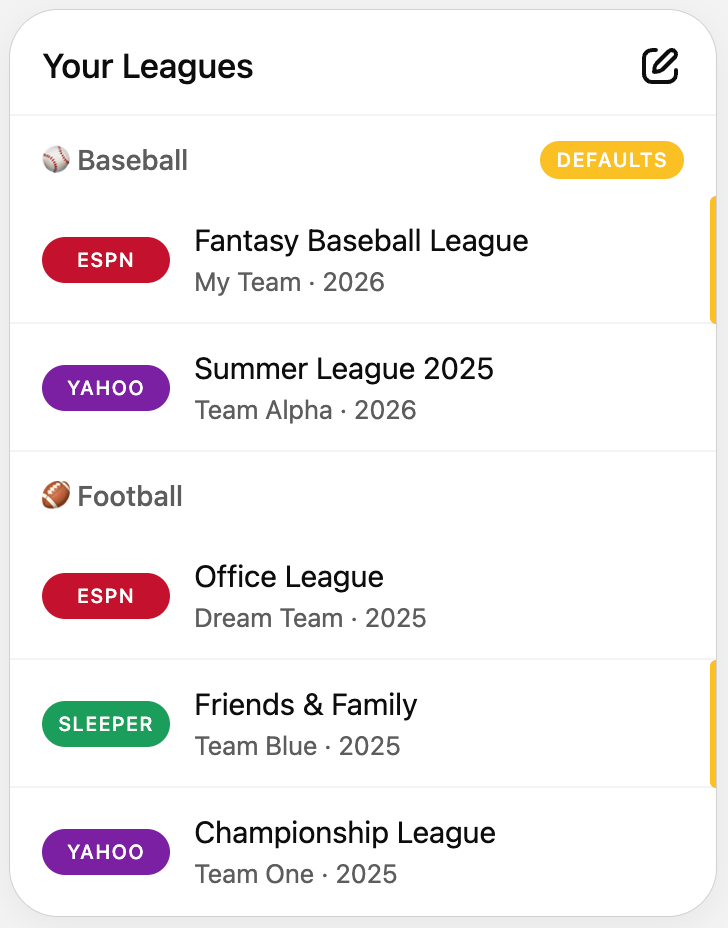
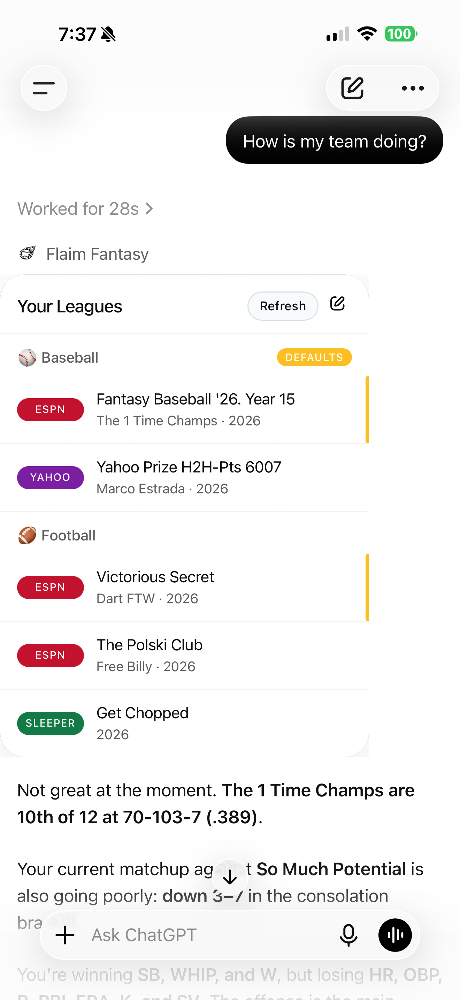
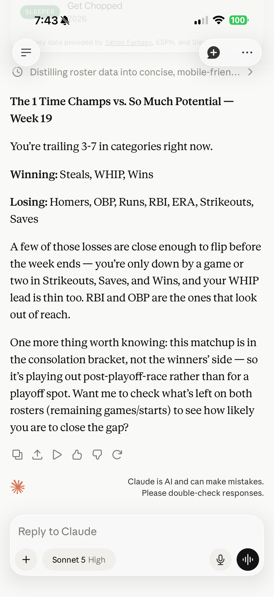
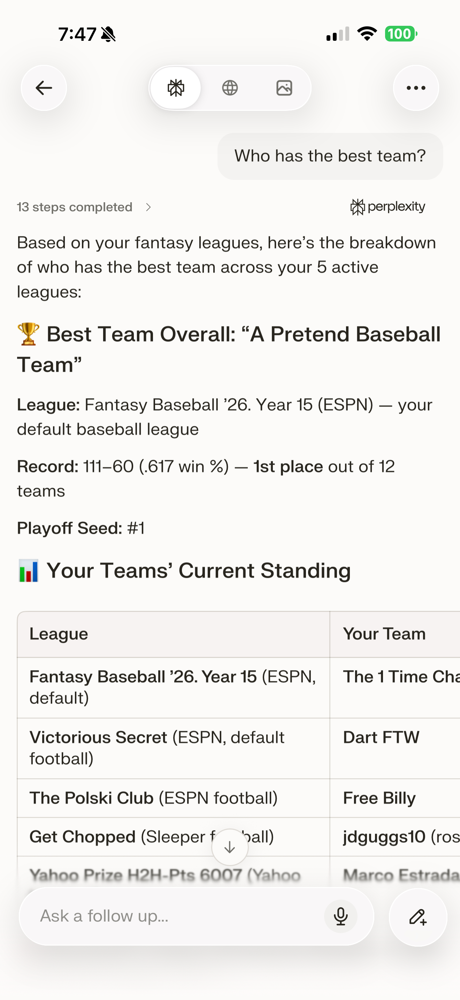

# Flaim Fantasy

Flaim Fantasy connects your ESPN, Yahoo and Sleeper fantasy leagues to ChatGPT and Claude, so you can ask about your actual team. "Who should I start this week?" "Is this trade fair?" "What's on the waiver wire?" The AI answers with your real league in front of it.

Flaim is read-only. It can look at your leagues, but it can't set lineups, add or drop players, make trades or change settings. It's free, and it's an independent project.

<p align="center">
  
</p>

## Get started

1. **Connect your leagues** at [flaim.app](https://flaim.app). ESPN connects through the Flaim Chrome extension, Yahoo through Yahoo sign-in, and Sleeper by username.
2. **Open Flaim Fantasy** in [ChatGPT](https://chatgpt.com/plugins/plugin_asdk_app_69a8f78087e081919e52cacacf00ff36) or [Claude](https://claude.ai/directory/connectors/f1a5b6a4-1f5b-470c-af23-71fc7ab13754) and ask about your team.

That's it.

## See it in action

<table>
  <tr>
    <td align="center" width="33%"><strong>ChatGPT</strong><br>Ask about the team you actually manage</td>
    <td align="center" width="33%"><strong>Claude</strong><br>See what is happening across your league</td>
    <td align="center" width="33%"><strong>Perplexity</strong><br>Bring your league into your research</td>
  </tr>
  <tr>
    <td align="center"></td>
    <td align="center"></td>
    <td align="center"></td>
  </tr>
</table>

## Need help?

To connect or manage leagues, go to [flaim.app/leagues](https://flaim.app/leagues). For anything else, email [support@flaim.app](mailto:support@flaim.app). Please keep account details out of public issues.

## Help make Flaim smarter

How well Flaim works comes down to how its skills and tool descriptions are written, and small wording changes can make a real difference. If you've watched the AI misread something or give advice you'd change, we'd love to hear about it.

- **Suggest a wording change.** [Open an issue](https://github.com/jdguggs10/flaim-fantasy/issues/new/choose) with the **Tool or skill wording suggestion** form. Tell us what the AI got wrong and quote the text you'd change.
- **Share a skill of your own.** Built something that works well with Flaim, like a weekly league recap or a trade deadline checklist? Add it under `community/`. The [weekly league recap](community/weekly-league-recap/SKILL.md) is a working example to start from. Have an idea but not a skill yet? Use the **Skill idea** form.

Pull requests to the official skills are welcome too. These files are mirrored from Flaim's main codebase, so instead of merging here we'll bring your change in with co-author credit, and it syncs back automatically. See [CONTRIBUTING.md](CONTRIBUTING.md) for details.

## For tinkerers

### What's in this repo

- **`.agents/skills/`**: the official Flaim skills. They're the analyst playbook an AI follows for start/sit calls, waivers, trades, keepers, matchups and more.
- **`tools/`**: a daily snapshot of the live tool descriptions (`tools.json`) and server instructions (`instructions.md`), taken straight from the server. Suggest changes to these with the issue form rather than a pull request, since they're rewritten every day.
- **`community/`**: skills shared by other Flaim users.
- **`.claude-plugin/`, `.codex-plugin/`, `.mcp.json` and `server.json`**: plugin packaging and MCP server details for developer tools.

The official files are copied here from Flaim's main codebase whenever they change, so this repo always matches what ships.

### Claude Code plugin

The plugin bundles the skills and the Flaim MCP server.

```bash
claude plugin marketplace add jdguggs10/flaim-fantasy
claude plugin install flaim-fantasy@flaim
```

Then run `/mcp` in Claude Code and choose the Flaim server to sign in. You'll need a Flaim account with at least one league connected. If you only want the MCP server, run `claude mcp add --transport http flaim https://api.flaim.app/mcp`.

### Skills in other tools

Tools that support Agent Skills look for them in your project's `.agents/skills/` folder, or in `~/.agents/skills/` for every project:

```bash
git clone https://github.com/jdguggs10/flaim-fantasy.git
cp -r flaim-fantasy/.agents/skills/flaim-fantasy ~/.agents/skills/flaim-fantasy
```

## License

MIT. See [LICENSE](LICENSE).
